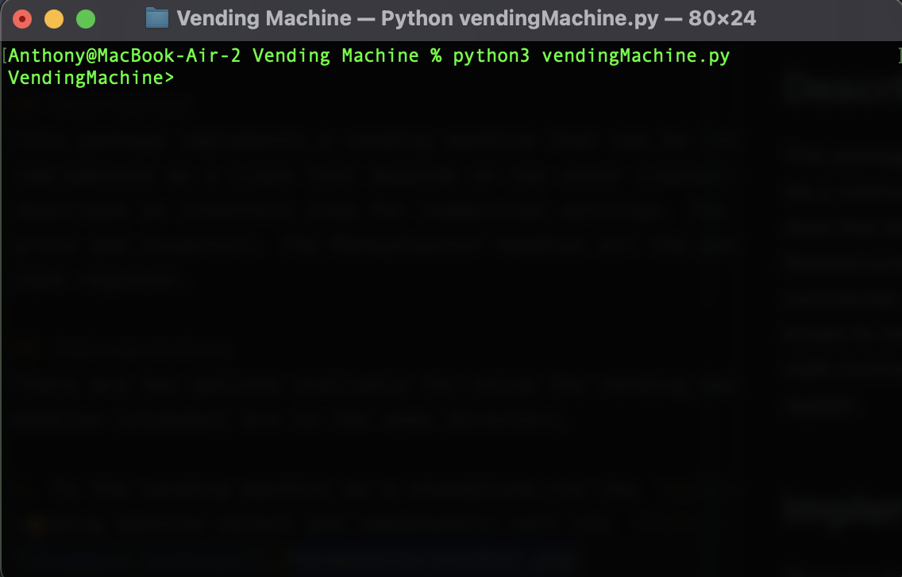

# Vending Machine
#### Author: 2d Lt Anthony Tolbert
#### Course: CSCE-086
#### Air Force Institute of Technology

## Description
This package implements a vending machine that can be interacted with via a commandline prompt. The vending machine is
implemented as a class that depends on two other classes: the Item class and the MoneyCounter class. The Item class
describes an inventory item for commercial settings. The Item is referenced by its name/description and knows its own
price and inventory. The MoneyCounter handles all the math involved in handling money and can be thought of as a smart
cash register. 

## Implementation
There are two options available for using the vending machine. First, ensure all three
modules (classes) are in the same directory.

1. To the vending machine as a standalone,run the `vendingMachine.py` file as a script. This will create a new
vending machine object and immediately call its `input()` function, prompting the user to interact with the machine. In effect, a new terminal session is started as shown below.

2. To use the vending machine in conjunction with another python project, the VendingMachine class can be imported and
used independently.

## Supported Commands

| Command Syntax                     | Example                  | Description                                                                                                                                                                           |
|------------------------------------|--------------------------|---------------------------------------------------------------------------------------------------------------------------------------------------------------------------------------| 
| balance                            | balance                  | shows the balance of the vending machine                                                                                                                                              |
| history                            | history                  | prints list of transactions                                                                                                                                                           |
| inventory                          | inventory                | prints current inventory (name, id, price, count)                                                                                                                                     |
| add item \<str\> \<int\> \<float\> | add item chips 2 $1.00   | add item to inventory with a custom name, price, and count                                                                                                                            |
| buy item \<str\> {5}\<int\>        | buy item chips 1 2 2 4 3 | buys an item with \# dollars, quarters, dimes, nickles, pennies. It also shows change given. For change, the machine   uses the largest denominator of curenncy that is available. |
| help                               | help                     | display this help message                                                                                                                                                             |
| exit                               | exit                     | exit the vending machine                                                                                                                                                              |

## Sample Input

The sample input below is a sequence of correctly formatted commands.   

    add item chips 20 $.50  
    add item coke 5 $.75  
    add item diet coke 5 $.75
    inventory  
    buy item coke 0 3 0 0 0  
    inventory  
    buy item chips 1 0 0 0 0  
    buy item diet coke 0 2 0 0 0
    inventory  
    history  
    balance

## Assumptions
- Only one transaction at a time (no cart)
- Machine starts with 5 of each denomination for change ($7.05 total) 